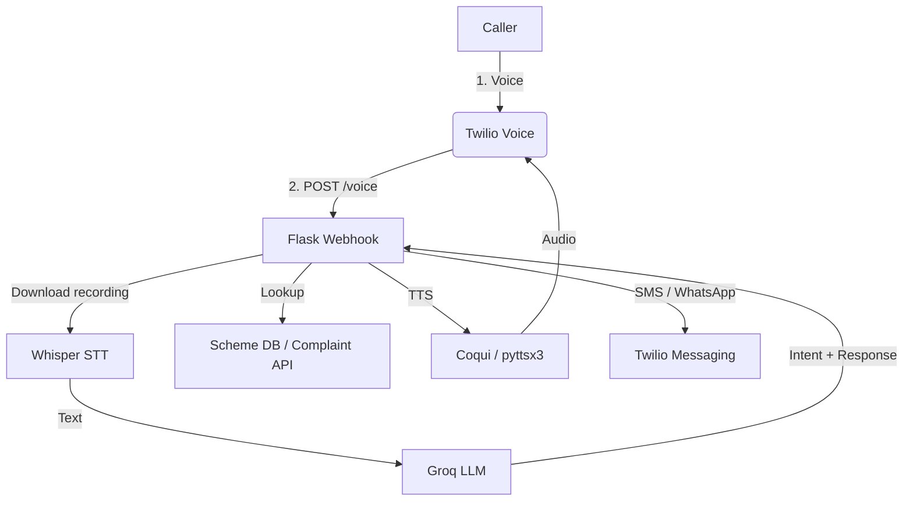

# JanaVaani — Voice Assistant for Bharat 🇮🇳

> Your voice. Your rights. One call away.


---

## 📜 Problem Statement

While **over a billion Indians own a mobile phone**, **most do not have a smartphone, reliable data, or the digital literacy** needed to navigate government portals or mobile apps.

Meanwhile, India’s welfare ecosystem is **highly fragmented**:

* A single city such as **Bengaluru has 40+ helpline numbers** for different civic services.
* Farmers rarely know **which scheme** fits their situation or **where to apply**.
* In distress, citizens are forced to **search, wait, or abandon** their request due to bureaucracy.

This results in:

* **Under-utilised welfare funds**
* **Unreported civic issues**
* **Low trust in public institutions**

> Despite hundreds of portals and helplines, **there is no unified, voice-first access point** for citizens to seek help, discover schemes, or file complaints.

## 🌟 Vision Statement

**JanaVaani** envisions a **single-call, AI-powered voice gateway to governance** for every Indian — urban or rural, literate or not.

> “If you can speak, you can get help.”

The platform will:

* **Listen** to any citizen via a plain phone call.
* **Understand** their language, intent and location using LLMs.
* **Guide** them to the correct scheme, solution or authority — instantly.
* **Report** civic issues on their behalf and follow-up with SMS or WhatsApp.

By making government services **voice-first and AI-driven**, JanaVaani delivers **access, clarity and action** without requiring an app, internet or technical know-how.

---

## 🎯 What is JanaVaani?

`JanaVaani` is an **AI-powered voice assistant** that citizens can call to:

1. **Speak** their problem in their native language.
2. **Understand** intent using a lightweight LLM (Groq Mixtral-8x7B).
3. **Guide** them to suitable schemes *or* file complaints automatically.
4. **Respond** with natural-sounding speech and follow-up SMS/WhatsApp.

The entire workflow happens inside a single phone-call—no smartphone or app required.

---

## 🧩 Key Features

### Multi-Agent Orchestration (NEW!)

JanaVaani now routes every utterance to the right **domain agent**:

| Agent | Triggers | What it does |
| ----- | -------- | ------------ |
| 🌾 **AgricultureAgent** | Mentions of crops, irrigation, farming | Recommends welfare schemes, subsidies & insurance |
| 🏛️ **CivicAgent** | Potholes, garbage, water leak, etc. | Captures location ➜ logs complaint to civic authority |
| 🚨 **EmergencyAgent** | Fire, accident, violence, etc. | Auto–dials police / ambulance / fire and sends caller an SMS |

An `AgentOrchestrator` analyses keywords and seamlessly forwards the call to the right agent.

| Module | Purpose |
| ------ | ------- |
| 🗣️ Voice Conversation | Bi-directional speech via Twilio Voice |
| 🎙️ Whisper STT | Converts incoming audio → text |
| 🧠 Groq LLM | Interprets intent & crafts helpful answers |
| 🧾 Scheme Recommender | Finds matching welfare schemes from `data/schemes.csv` |
| 🧭 Civic Reporter | Escalates complaints to e-mail / API endpoints |
| 🔊 Coqui / pyttsx3 TTS | Generates multilingual speech replies |
| 📲 SMS / WhatsApp | Sends call summary & links |
| 🌐 Multilingual | Hindi, Kannada, English (extendable) |

---

## ⚙️ Tech Stack

| Layer | Tech | Notes |
| ----- | ---- | ----- |
| Agent Framework | Custom Python package (`agents/`) | Orchestrator + domain agents |
| Telephony | **Twilio Voice & SMS** | Voice flow + SMS confirmations |
| Backend | **Flask (Python)** | Webhooks + agent invocation |
| LLM | **Groq API – Mixtral-8x7B** | Natural language understanding |
| STT | **OpenAI Whisper (local)** | Speech → text |
| TTS | **Coqui TTS** / **pyttsx3** | Text → speech |
| Data | **CSV / SQLite** | Schemes & call logs |
| DevOps | **ngrok / Render** | Tunnels & hosting |

| Layer | Tech | Notes |
| ----- | ---- | ----- |
| Telephony | **Twilio Voice** | Receive & record calls |
| Backend | **Flask (Python)** | Webhooks + business logic |
| LLM | **Groq API – Mixtral-8x7B** | Fast, free inference |
| STT | **OpenAI Whisper (local)** | Accurate transcription |
| TTS | **Coqui TTS** *(default)* / **pyttsx3** | Natural speech output |
| Data | **CSV / SQLite / Airtable** | Welfare schemes & call logs |
| Messaging | **Twilio SMS / WhatsApp** | Optional follow-ups |
| DevOps | **ngrok / Render / Railway** | Tunnels & hosting |

---

## 🏗️ System Architecture



---

## 📂 Repository Structure

```text
├── agents/
│   ├── __init__.py
│   ├── base.py               # Abstract agent class
│   ├── orchestrator.py       # Keyword router
│   ├── agriculture/          # AgricultureAgent
│   ├── civic/                # CivicAgent
│   └── emergency/            # EmergencyAgent
│       └── __init__.py
├── app.py                    # Flask entry-point & Twilio endpoints
```

```text
├── app.py              # Flask entry-point & Twilio endpoints
├── stt_whisper.py      # Speech-to-Text helper
├── tts.py              # Text-to-Speech helper
├── groq_agent.py       # Groq LLM wrapper
├── scheme_finder.py    # Welfare scheme matching logic
├── messaging.py        # SMS & WhatsApp helpers
├── translator.py       # Google-Translate wrapper
├── store.py            # Persistent call logs (JSONL / SQLite)
├── requirements.txt
├── .env.example        # Template for environment variables
├── data/
│   └── schemes.csv     # Knowledge-base of schemes
└── static/             # Audio and static assets
```

---

## 🚀 Quick Start (Local)

### 1. Clone & Install

```bash
git clone https://github.com/<you>/JanaVaani.git
cd JanaVaani
python -m venv .venv
.venv\Scripts\activate      # PowerShell (Windows)
pip install -r requirements.txt
```

### 2. Configure Environment Variables

Copy `.env.example` ➡️ `.env` and fill in:

```
TWILIO_ACCOUNT_SID=<sid>
TWILIO_AUTH_TOKEN=<token>
TWILIO_PHONE_NUMBER=<+1…>
GROQ_API_KEY=<key>
```

### 3. Run the Server

```bash
python app.py
```

Expose it with **ngrok**:

```bash
ngrok http 5000
```

Point your Twilio Voice webhook to `https://<ngrok>.ngrok-free.app/voice` and call your number!

---

## 🧪 Testing

* Unit-test modules with `pytest`.
* Use Twilio Console’s *Test-to-speech* to simulate calls.
* Verify multiple languages & accents.

---

## 📈 Roadmap

- [ ] Replace CSV with RAG + vector DB
- [ ] Add dashboard (React / Streamlit) for NGO/Gov visibility
- [ ] Offline missed-call → automatic callback queue
- [ ] WhatsApp text bot
- [ ] Regional language expansion (Bengali, Tamil…)

---

## 🤝 Contributing

1. Fork the repo & create a branch (`git checkout -b feat/awesome`)
2. Commit your changes and open a PR.
3. Make sure `pre-commit` hooks pass.

---

## 📄 License

Distributed under the MIT License. See `LICENSE` for more information.

---

© 2025 JanaVaani Team


* Accept inbound voice calls via **Twilio**
* Converts speech ↔ text with **OpenAI Whisper** and **pyttsx3** (offline TTS – swap with Coqui if desired)
* Fast reasoning with **Groq** LLMs (Mixtral-8x7b)
* Recommends relevant government schemes from a CSV knowledge-base
* Sends SMS & WhatsApp summaries to the caller
* Supports language translation (English ⇄ Hindi/Kannada) via Google Translate or `googletrans`
* Simple admin dashboard endpoint to view recent calls


1. ️Clone repo inside current folder.
2. Create virtual env & install deps:

```bash
python -m venv .venv
source .venv/Scripts/activate  # Windows
pip install -r requirements.txt
```

3. Copy `.env.example` to `.env` and fill Twilio / Groq keys.

4. Run the server:

```bash
python app.py
```

5. Expose local port with ngrok (or Cloudflare tunnel):

```bash
ngrok http 5000
```

6. Point your Twilio phone-number Voice webhook to `https://<ngrok>.ngrok-free.app/voice`.

7. Call the number – the agent will interact in Hindi by default and send you a summary SMS/WhatsApp.


```
│ app.py              # Flask server + endpoints
│ stt_whisper.py      # Speech-to-text helper
│ tts.py              # Text-to-speech helper
│ groq_agent.py       # Groq LLM wrapper
│ scheme_finder.py    # Finds relevant govt schemes
│ messaging.py        # SMS & WhatsApp helpers via Twilio
│ translator.py       # Google Translate wrapper
│ store.py            # Saves call logs (JSONL)
│ requirements.txt
│ .env.example
│ data/
│   └── schemes.csv   # Gov schemes knowledge-base
└─ static/
```


* Add more languages → improve `translator.py`
* Swap pyttsx3 with Coqui TTS for better quality
* Integrate real complaint-filing APIs in `handle_conversation_logic`
* Build beautiful React dashboard that consumes `/admin/calls`

---

